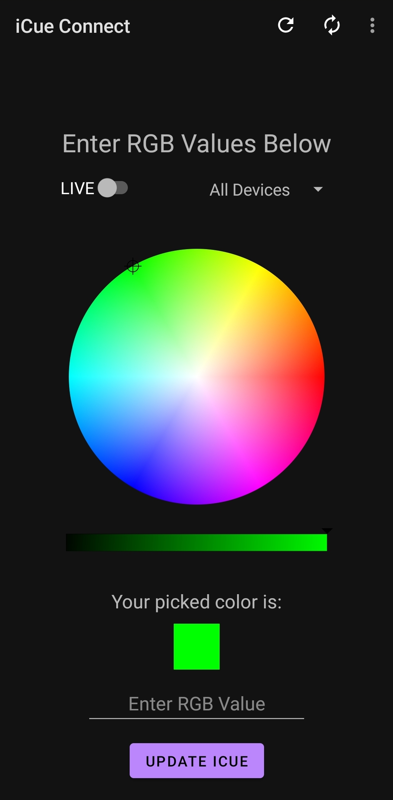

# iCueConnect-Android 
## Description
iCueConnect-Android is an Android app that allows you to control your Corsair iCUE device LEDs with the help of the [iCueConnect-API](https://github.com/ScreamingOranges/iCueConnect-API)<br/>
**[Video Example In Use](https://imgur.com/a/CzNtWbY)<br/>**
**THIS README APPLIES FOR THE iCueConnect-Android APP....**<br/>
**FOR DOCUMENTATION REGARDING iCueConnect-API, CLICK THE PRIOR LINK**
>Note: This is an early development release. Some things may not work perfectly, and you may experience some bugs/glitches. Please feel free to inform me of any issues you are having via the issues tab.

## Requirements
* You will need iCue installed and running on your windows machine.
* You will need to download and configure the iCueConnect-API on your windows machine.
* You will have to have configured all your Corsair devices through iCUE.
* In order for iCueConnect-Android App to communicate with [iCueConnect-API](https://github.com/ScreamingOranges/iCueConnect-API) and set the LEDs accordingly, both devices must be connected to the internet.
* Lastly you will have to check the **Enable SDK** option in iCUE's Settings.
<p align="center">
  
</p>

## Installation Instructions & Configuration

### Downloading  
1. Download the iCueConnect-Android App [here](https://github.com/ScreamingOranges/iCueConnect-Android/releases). 
2. You will be receive a notification asking what to open the file with. Select **Package installer**.
3. You may receive a security warning stating that your phone is not allowed to install unknown apps from this source. Two buttons will be displayed, **Cancel** and **Settings**. Click **Settings**.
4. Toggle the option labeled **Allow from this source** so that it is ON.
5. Press the back button so that you are on the screen showing the prompt asking **Do you want to install this application**. Two buttons will be displayed, **Cancel** and **Install**. Click **Install**.

### Setting Up Pusher
iCueConnect uses Pusher for realtime communication between iCueConnect-Android App and iCueConnect-API using sockets. You do not have to know exactly what Pusher is and how it works. You just need to make an account in order for this iCueConnect to work. If you have not done so already preform the following to create a Pusher account.<br>


1. Create a free Pusher account [here](https://dashboard.pusher.com/accounts/sign_up).
2. When asked to get started between Channels or Breams, choose **CHANNELS**.
3. When given the following input fields, enter the associated values and then press the "Create app" button.
    * Name your app: *iCueConnect*
    * Select a cluster: *Choose according to your region.*
    * Create apps for multiple environments?: Unchecked.
    * Choose your tech stack (optional): *You can ignore these.*
4. After clicking "Create app", click the link on the left side labeled "App Keys". Here you will see four values labeled 
    * *app_id*
    * *key*
    * *secret*
    * *cluster*
5. Save these values. We will need them later.

### Configuring iCueConnect on Android 
1. Make sure that you downloaded and configured the iCueConnect-API. **If you did not do this, the app will not work**.
2. Open iCueConnect on Android and click Setting from the menu in the top right corner.
3. In the fields enter the associated values that we got from creating a Pusher account. <br/> **DO NOT ENTER THE QUOTATION MARKS, ONLY ENTER THE TEXT**
4. Click the **SAVE** button to set the values.
    > Note: If you enter an incorrect value for any of the fields, simply update the values in the fields and click the **SAVE** button again.

## How To Use
When you first open the app you will be presented with the homepage.<br> 
This is the main page where you can control your LEDs.<br>



### The Menu Bar 
* The menu bar is the main way to navigate throughout the app, and only has four buttons. <br>

1. **Revert Control** 
   * This reverts LED control back to iCue. 
   * For example, if you set the LEDs to a color, then they will stay that color unless you click this button.
2. **Sync Devices**
   * This sends a request to the iCueConnect API for all the devices configured via iCUE. Once the information is received it populates the drop down.
3. **Help**  
   * This button redirects to a page shows the readme file for the iCueConnect-Android app.
4. **Settings**
   * This button redirects to the previously mentioned [Setting Up Pusher](#setting-up-pusher) section.

### Controlling LEDs
  1. Select an option from the dropdown below the **Enter RGB Values Below** title where all your devices will appear. If only *All Devices* appears, then you will need to sync your devices (make sure the iCue Connect API is updated and running).<br/> 
  2. Toggle the *LIVE* switch to update your computers Leds in realtime.
        > Note: Pusher limits you to 200,000 messages a day with the free plan, and using the *LIVE* option eats through that. You can check how many messages you sent under the *Overview* tab for your account's app on pusher's website.
  3. Use the color wheel to select the color of your choice. You can preview the color of your choice via the color square.
  4. Use the horizontal bar to select the brightness. 
  5. **(OPTIONAL)** Instead of using the color wheel and the brightness bar, you can enter RGB values in the input field. Each value should be from 0 to 255, and should be separated by a space. For example:
      * Passing the color RED
        ```
        255 0 0
        ```
     * Passing the color GREEN
        ```
        0 255 0
        ```
     * Passing the color BLUE
        ```
        0 0 255
        ```

### Notification LEDs
This option can be enabled from the **Notification Leds** option in the android app's settings page.


## Help
* Leds not updating according to your phones selection? Follow these trouble shooting steps.
    * Select the **Test** button from the iCue Connect API.
    * Make sure that iCue is running in the background and that the **Enable SDK** option is set in the settings.
    * Sometimes iCue will need to be reopened. Try that.
    * Make sure your Pusher credentials are correct on both devices. 
        > Note: If you enter any of the values incorrectly, simply go into the iCueConnect folder that we created earlier, delete the **data.json** file, and run the iCueConnect.exe again.
    * Pusher credentials are correct, but leds are still not updating? Try running iCueConnect.exe as an administrator.
* Leds are extremely delayed?
    * Leds on occasion can become delayed, however if there is a continues long delay then try setting iCueConnect's priority to realtime or high. Don't know how to do this? Check this [tutorial](https://winaero.com/change-process-priority-windows-10/) out then!
        > Note: iCueConnect will appear in the Details tab twice in the Task Manager. Set both accordingly. 
* Are notification LEDs not working properly?
  * Make sure you allowed the option **Notification Leds** in the android app's settings page.
  * If the setting is enabled, then you will need to make sure that battery optimization is disabled for the android app.

## Disclaimer 
**I do not work for nor did I partner up with Corsair to produce this application. I am simply an enthusiast who just wanted to bring an idea to life.**

# For Developers

## Utilized Dependencies 
* androidx.appcompat:appcompat:1.2.0
* com.google.android.material:material:1.3.0
* androidx.constraintlayout:constraintlayout:2.0.4
* junit:junit:4.+
* androidx.test.ext:junit:1.1.2
* androidx.test.espresso:espresso-core:3.3.0
* com.pusher:pusher-http-java:1.2.0
* com.pusher:pusher-java-client:2.2.6
* androidx.localbroadcastmanager:localbroadcastmanager:1.0.0
* com.google.code.gson:gson:2.8.6
* com.github.duanhong169:colorpicker:1.1.6
* androidx.palette:palette:1.0.0
* group: 'com.fasterxml.jackson.core', name: 'jackson-databind', version: '2.11.3'
